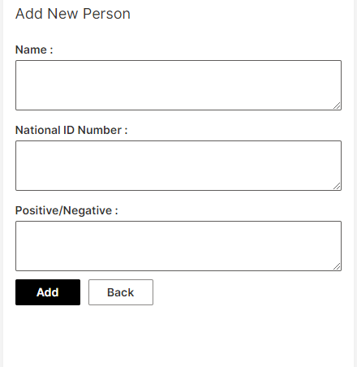
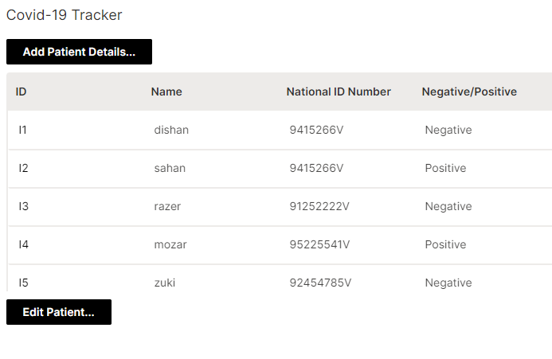
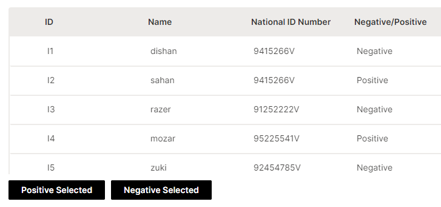

# Wave Covid Tracker

This application allows you to find the positive and negative covid-19 patient data easily.

### Add Patient Data


### View Patient Data


### Edit Patient Data


## Running this App Locally

### System Requirements

1. Python 3.6+
2. pip3

### 1. Run the Wave Server

New to H2O Wave? We recommend starting in the documentation to [download and run](https://h2oai.github.io/wave/docs/installation) the Wave Server on your local machine. Once the server is up and running you can easily use any Wave app.

### 2. Setup Your Python Environment

```bash
git clone https://github.com/DilshanDilipudara/covid-traker.git
cd covid-traker
python3 -m venv venv
source venv/bin/activate
pip install -r requirements.txt
```


### 4. Run the App

```bash
 wave run main
```

### 5. View the App

Point your favorite web browser to [localhost:10101/covid](http://localhost:10101/covid)
